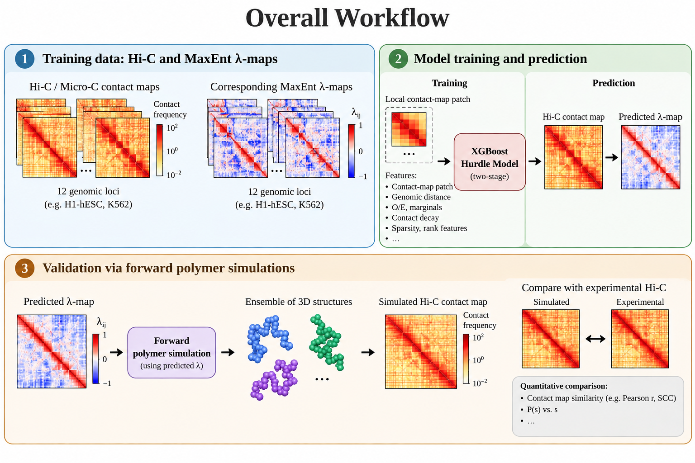

# Learning Chromatin Interaction Landscapes from Micro-C via Maximum Entropy Surrogates

## Overview
This project develops a machine-learning surrogate for maximum-entropy (MaxEnt) inference of chromatin interaction landscapes from Hi-C and Micro-C contact maps. The approach uses a two-stage XGBoost hurdle model trained on local contact-map patches to directly predict the interaction matrix λᵢⱼ, which describes the underlying chromatin organization.

The surrogate substantially reduces the computational cost of MaxEnt inference, from hours per genomic locus to seconds, while maintaining high agreement with independently inferred MaxEnt solutions. The predicted λ-matrices can also be used in forward polymer simulations to reproduce experimental chromatin contact maps, demonstrating that the learned interaction landscape retains physically meaningful information.

Overall, the project provides a scalable and physically interpretable framework for genome-wide chromatin ensemble inference, enabling the study of chromatin organization beyond the polymer-connectivity effects directly visible in experimental contact maps.

## Surrogate framework
The overall workflow consists of two major stages. We have experimentally measured Micro-C contact maps and their corresponding MaxEnt-inferred λ-maps for 12 genomic loci. These data are used to train a two-stage XGBoost hurdle model that learns the mapping from local contact-map features to the underlying interaction matrix λij. The trained surrogate is then used to predict λ-maps directly from Hi-C contact maps. Finally, the predicted λ-maps are used as input to forward polymer simulations to generate ensembles of 3D chromatin structures and corresponding simulated contact maps, which are compared against the experimental Hi-C maps.

  

## Input Data:
Each training locus should contain:

	locus_folder/
	├── contact_map
	└── lamda.txt

The λ-map should be provided in 3-column sparse format:

row    column    lambda_value

For example:

0    0    -12.34

0    1     5.67

0    2    -8.91

...

The training script expects the λ-map to be named: lamda.txt and located inside the corresponding locus directory.

## Repository Structure
	project/
	│
	├── data/
	│   ├── locus_01/
	│   │   ├── contact_map
	│   │   └── lamda.txt
	│   │
	│   ├── locus_02/
	│   │   ├── contact_map
	│   │   └── lamda.txt
	│   │
	│   └── ...
	│
	├── xgboost_hurdle_v10_cpu.py

## Training the Model

After preparing the 12 loci and activating the required Python environment,
run:

	python xgboost_hurdle_v10_cpu.py

The default execution performs:

1. Loading the Hi-C contact maps and corresponding MaxEnt λ-maps.
2. Construction of local contact-map features.
3. Training of the two-stage XGBoost hurdle model.
4. Leave-one-locus-out cross-validation (LOOCV) across all 12 loci.
5. Evaluation of λ-map predictions using R², Pearson correlation, Spearman correlation, and MAE.
6. Training of the final production model using all 12 loci.

## Output Files

The training procedure generates the following main files:

	xgb_v10_loocv_results.csv
	xgb_v10_fold00_<name>.png
	xgb_v10_fold00_<name>_pred.npy
	xgb_v10_fold00_<name>_metrics.json
	...
	xgb_v10_fold11_<name>.png
	xgb_v10_fold11_<name>_pred.npy
	xgb_v10_fold11_<name>_metrics.json

	xgb_v10_clf.json
	xgb_v10_reg.json
	xgb_v10_meta.json

The two final model files are:

	xgb_v10_clf.json
	xgb_v10_reg.json

where:

	xgb_v10_clf.json — classifier used to determine whether a λij interaction is non-zero.
	xgb_v10_reg.json — regressor used to predict the magnitude of λij.
	xgb_v10_meta.json — metadata describing the trained model and training configuration.

## From Training to Prediction

Once training is complete, the saved XGBoost models can be used to predict a
λ-map directly from a new Hi-C/Micro-C contact map:

	Experimental Hi-C / Micro-C
	             │
	             ▼
	      Feature extraction
	             │
	             ▼
	     XGBoost hurdle model
	        ┌────┴────┐
	        ▼         ▼
	   Classifier   Regressor
	        └────┬────┘
	             ▼
	       Predicted λ-map
	             │
	             ▼
	     Forward polymer
	        simulation
	             │
	             ▼
	    Ensemble of 3D
	      structures
	             │
	             ▼
	      Simulated Hi-C
	             │
	             ▼
	   Comparison with
	 experimental Hi-C

The trained model does not require a cell-type label during prediction; the features are derived directly from the input contact matrix.

## Relevant software:
	Cooler
	Cooltools
	XGBoost
	NumPy
	SciPy
	Scikit-learn
	pyBigWig

## Author

Rahul Mittal, Siddhant Bhardwaj, Trisha Majumdar, and Arnab Bhattacherjee∗

Email: arnab@jnu.ac.in

Institution: JNU, New Delhi
